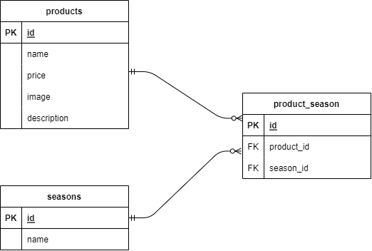

# mogitate
## 環境構築
まずアプリケーションのディレクトリを作成しています。
ここでは「mogitate」
```
$ mkdir mogitate
$ cd mogitate
$ mkdir docker src
$ touch docker-compose.yml
$ cd docker
$ mkdir mysql nginx php
$ mkdir mysql/data
$ touch mysql/my.cnf
$ touch nginx/default.conf
$ touch php/Dockerfile
$ touch php/php.ini
```
その後各ファイルを作成します。
ファイルが出来たら環境構築を行い、パッケージをインストールした後テーブルとダミーデータの作成を行います。
```
$ docker compose build
$ docker compose up -d
$ docker compose exec php bash

$ composer install

$ php artisan migrate
$ php artisan db:seed
```
## 使用技術(実行環境)
フレームワーク：Laravel  8.83.27　　

PHP：PHPバージョン: 7.4.9　　

データベース：MySQL 8.0.26　　

## ER図

## URL
開発環境:http://localhost/products
